# Little Light - A Multi-Role Donation Platform 💙

Welcome to the official repository for **Little Light**, a comprehensive, role-based donation platform designed to connect those in need with those who can help. Built with Flutter, this application provides a seamless and secure ecosystem for donors, requesters, and delivery personnel, all managed through a powerful admin panel. This project was developed as a Final Year Project.

<p align="center">
  
</p>

---

## ✨ Core Idea & Mission

The mission of **Little Light** is to bring "Light in the darkness" by creating a transparent, efficient, and user-friendly platform for charitable giving. The app addresses the challenge of connecting donors with verified requesters and managing the logistics of donation pickup and delivery, ensuring that help reaches those who need it most.

---

## 🔑 Key Features

- **Four Unique User Roles:** A complete system with separate interfaces and functionalities for **Donors**, **Requesters**, **Delivery Personnel**, and **Admins**.
- **Multiple Donation Types:** Supports donations of Food, Clothes, Books, and Financial aid (Education, Weddings, Medical).
- **Real-time Communication:** In-app chat with voice messaging capabilities for seamless interaction.
- **Live GPS Tracking:** Donors, requesters, and delivery personnel can track real-time delivery status on a map.
- **Secure Payments:** Integrated with Stripe and local payment gateways like Easypaisa and JazzCash for financial donations.
- **Real-time Notifications:** Push notifications powered by OneSignal for instant updates on donation and request statuses.
- **Comprehensive Admin Panel:** A powerful web-based interface for managing users, donations, requests, and funds.
- **Reporting & Analytics:** Detailed reports and graphs for donors (donation history) and admin (overall platform performance).

---

## 🛠️ Technology Stack

- **Framework:** **Flutter** - For a beautiful, high-performance, cross-platform experience on Android & iOS.
- **Backend:** **Firebase** (Firestore, Authentication, Storage) - For a scalable, real-time backend.
- **State Management:** **Provider**
- **Payment Gateways:** **Stripe**, **Easypaisa**, **JazzCash**
- **Mapping & Geolocation:** **Google Maps API**
- **Push Notifications:** **OneSignal**
- **UI/UX Design:** **Figma**

---

## 📸 Application Walkthrough (Complete Screenshots)

A comprehensive visual tour of the "Little Light" mobile application, showcasing every key screen and user journey.

### 1. Welcome & Authentication
The initial entry points for users, including splash screen, onboarding, login, and registration.

<p align="center">
  
  
  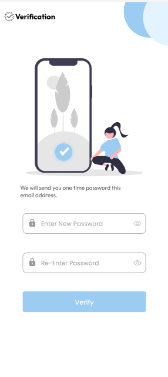
  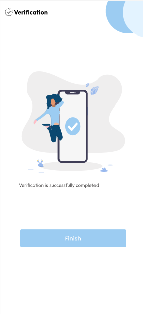
</p>
<p align="center">
  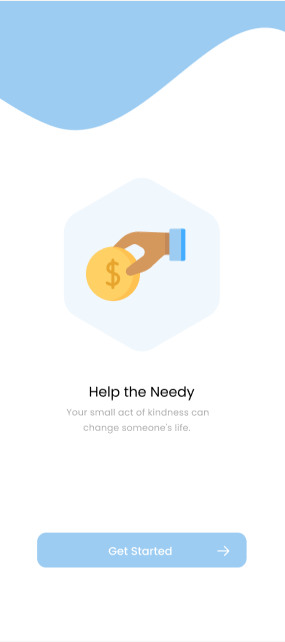
  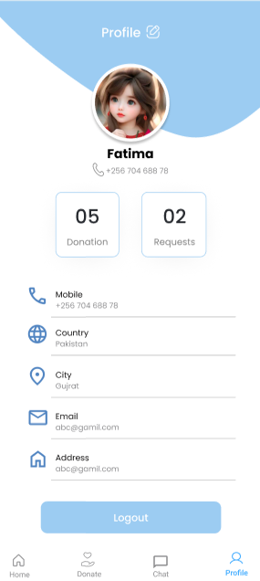
  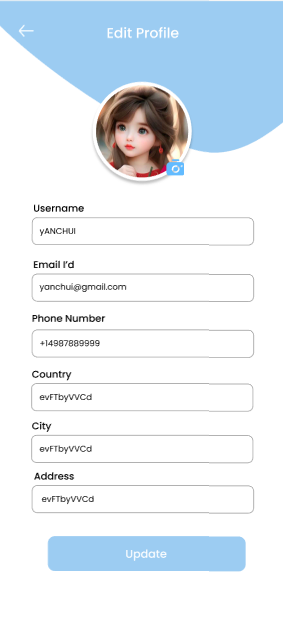
</p>

### 2. Donor's Journey 💖
Donors can easily contribute items or funds, view requests, and track their impact.

#### Donor Dashboard & Making a Donation
<p align="center">
  
  
  
  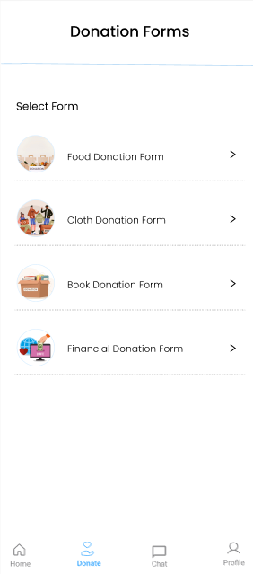
</p>
<p align="center">
  
  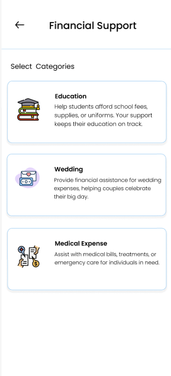
  
  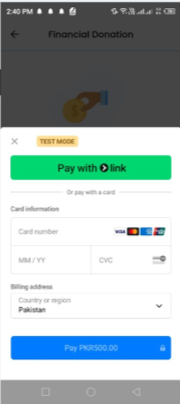
</p>

#### Viewing Requesters & Pickup Requests
<p align="center">
  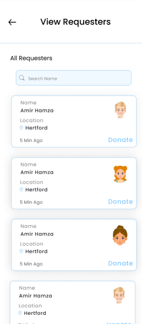
  
  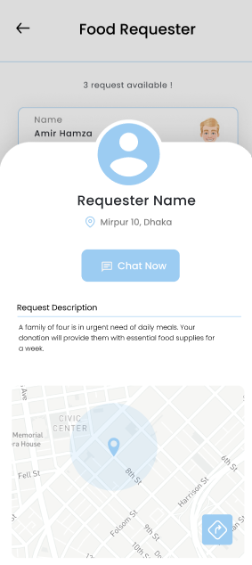
  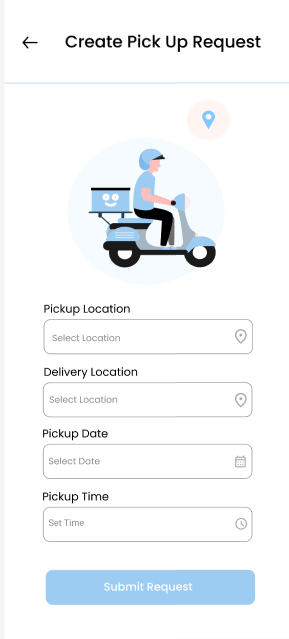
</p>

#### Donation History & Reports
<p align="center">
  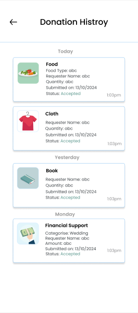
  
  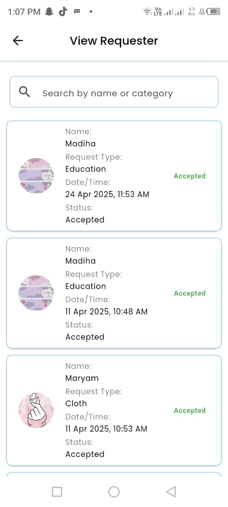
</p>

### 3. Requester's Journey 🙏
Requesters can easily submit their needs and track the status of their requests.

<p align="center">
  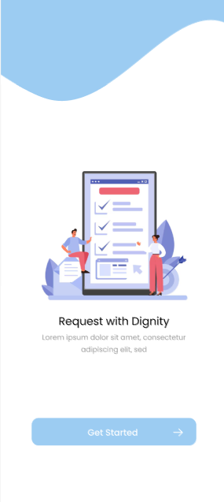
  
  
  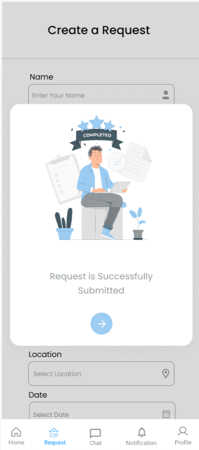
  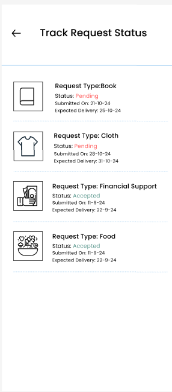
</p>


### 4. Delivery Personnel's Journey 🛵
Delivery personnel manage pickups and drop-offs with live GPS tracking.

<p align="center">
  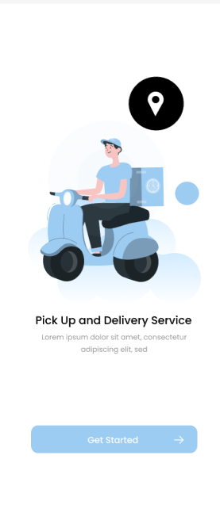
  
  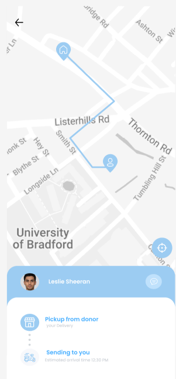
  
</p>

### 5. Common Features (Chat, Notifications, Profile Management)
These essential features enhance user experience across all roles.

<p align="center">
  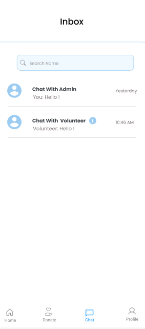
  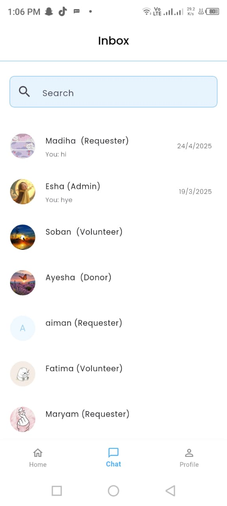
  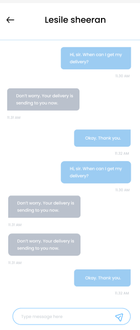
  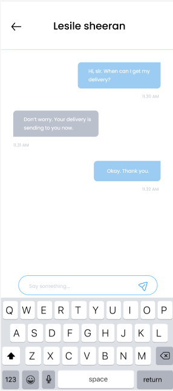
</p>
<p align="center">
  
  
  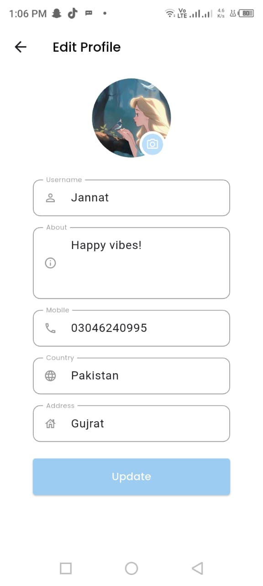
  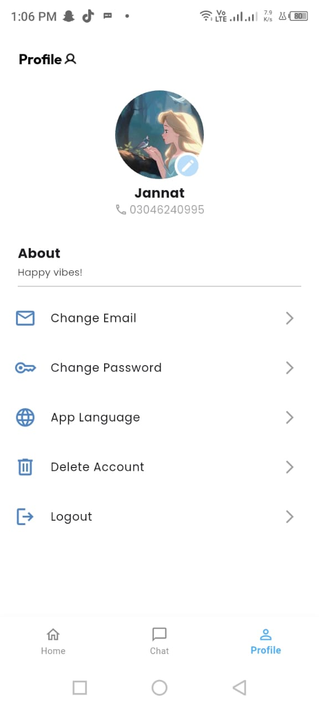
</p>
<p align="center">
  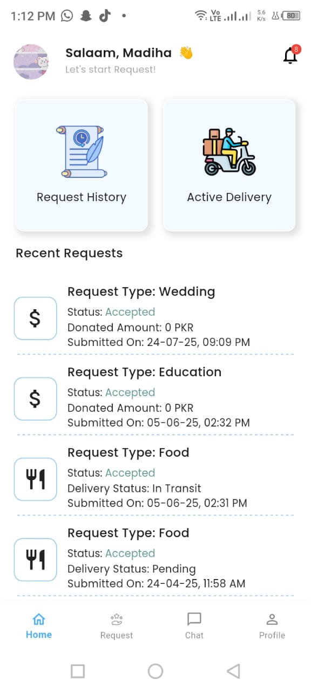
  
  
</p>

### 6. Admin Panel
The central control hub for managing the entire platform.

<p align="center">
  
  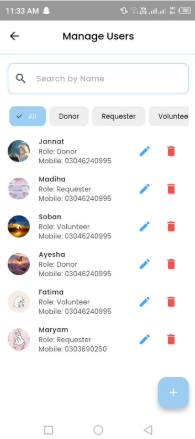
  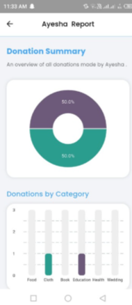
</p>

---

## 🚀 Getting Started

To get a local copy up and running, follow these simple steps.

1.  **Clone the Repository:**
    ```bash
    git clone <your-repository-url>
    ```
2.  **Install Dependencies:**
    ```bash
    flutter pub get
    ```
3.  **Configure Environment:**
    - Add your Firebase configuration files (`google-services.json` for Android, `GoogleService-Info.plist` for iOS).
    - Create a file `lib/api_key.dart` for sensitive keys (Google Maps, Stripe, etc.) and add it to `.gitignore`.

4.  **Run the App:**
    ```bash
    flutter run
    ```