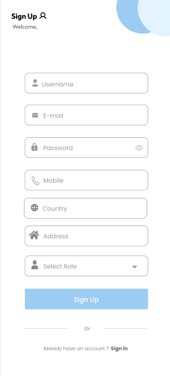

# Little Light - A Multi-Role Donation Platform 💙

Welcome to the official repository for **Little Light**, a comprehensive, role-based donation platform designed to connect those in need with those who can help. Built with Flutter, this application provides a seamless and secure ecosystem for donors, requesters, and delivery personnel, all managed through a powerful admin panel. This project was developed as a Final Year Project.

<p align="center">
  
</p>

---

## ✨ Core Idea & Mission

The mission of **Little Light** is to bring "Light in the darkness" by creating a transparent, efficient, and user-friendly platform for charitable giving. The app addresses the challenge of connecting donors with verified requesters and managing the logistics of donation pickup and delivery, ensuring that help reaches those who need it most.

---

## 🔑 Key Features

- **Four Unique User Roles:** A complete system with separate interfaces for **Donors**, **Requesters**, **Delivery Personnel**, and **Admins**.
- **Multiple Donation Types:** Supports donations of Food, Clothes, Books, and Financial aid.
- **Real-time Communication:** In-app chat with voice messaging capabilities.
- **Live GPS Tracking:** Real-time tracking of donation pickups and deliveries.
- **Secure Payments:** Integrated with Stripe and local payment gateways.
- **Push Notifications:** Powered by OneSignal to keep users updated on their status.
- **Reporting & Analytics:** Users can view detailed reports of their donation history and impact.

---

## 🛠️ Technology Stack

- **Framework:** **Flutter** (for Android & iOS)
- **Backend:** **Firebase** (Firestore, Authentication, Storage)
- **State Management:** **Provider**
- **Payment Gateways:** **Stripe**, **Easypaisa**, **JazzCash**
- **Mapping & Geolocation:** **Google Maps API**
- **Push Notifications:** **OneSignal**
- **UI/UX Design:** **Figma**

---

## 📸 Application Walkthrough

A visual tour of the "Little Light" mobile application.

### 1. User Roles & Dashboards
The app provides a unique and tailored experience for each user role.

<p align="center">
  
  
  
  
</p>

### 2. The Donation & Request Flow
A seamless process for both donating and requesting help.

<p align="center">
  
  
  
  
</p>

### 3. Core Features in Action
From live tracking to real-time chat and notifications.

<p align="center">
  
  
  
  
</p>

### 4. User Authentication
A simple and secure authentication flow.

<p align="center">
  
  
  
</p>

---

## 🚀 Getting Started

To get a local copy up and running, follow these simple steps.

1.  **Clone the Repository:**
    ```bash
    git clone <your-repository-url>
    ```
2.  **Install Dependencies:**
    ```bash
    flutter pub get
    ```
3.  **Configure Environment:**
    - Add your Firebase configuration files (`google-services.json` for Android, `GoogleService-Info.plist` for iOS).
    - Create a file `lib/api_key.dart` for sensitive keys (Google Maps, Stripe, etc.) and add it to `.gitignore`.

4.  **Run the App:**
    ```bash
    flutter run
    ```