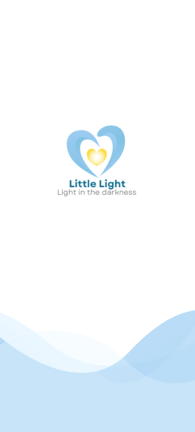
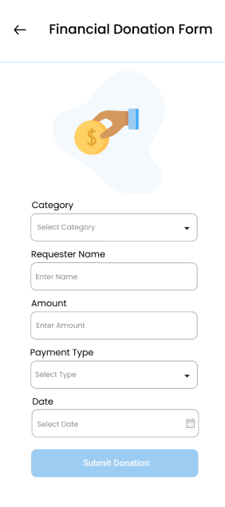

# Little Light - A Multi-Role Donation Platform 💙

Welcome to the official repository for **Little Light**, a comprehensive, role-based donation platform designed to connect those in need with those who can help. Built with Flutter, this application provides a seamless and secure ecosystem for donors, requesters, and delivery personnel, all managed through a powerful admin panel. This project was developed as a Final Year Project.

<p align="center">
  
</p>

---

## ✨ Core Idea & Mission

The mission of **Little Light** is to bring "Light in the darkness" by creating a transparent, efficient, and user-friendly platform for charitable giving. The app addresses the challenge of connecting donors with verified requesters and managing the logistics of donation pickup and delivery, ensuring that help reaches those who need it most.

---

## 🔑 Key Features

- **Four Unique User Roles:** A complete system with separate interfaces and functionalities for Donors, Requesters, Delivery Personnel, and Admins.
- **Multiple Donation Categories:** Supports donations of Food, Clothes, Books, and Financial aid for categories like Education, Weddings, and Medical expenses.
- **Real-time Communication:** In-app chat with voice messaging capabilities to facilitate smooth communication between users.
- **Live GPS Tracking:** Donors and requesters can track the delivery personnel in real-time on a map.
- **Secure Payments:** Integrated with Stripe, Easypaisa, and JazzCash for secure financial donations.
- **Real-time Notifications:** Push notifications powered by OneSignal keep users updated on their request and donation statuses.
- **Comprehensive Admin Panel:** A full-featured web panel for complete control over users, donations, requests, and system settings.
- **Reporting & Analytics:** Users can view detailed reports of their donation history and impact.

---

## 🛠️ Technology Stack

- **Framework:** **Flutter** - For a beautiful, high-performance, cross-platform experience on Android & iOS.
- **Backend:** **Firebase** (Firestore, Authentication, Storage) - For a scalable, real-time backend.
- **State Management:** **Provider**
- **Payment Gateways:** **Stripe**, **Easypaisa**, **JazzCash**
- **Mapping & Geolocation:** **Google Maps API**
- **Push Notifications:** **OneSignal**
- **UI/UX Design:** **Figma**

---

## 📸 Application Walkthrough (Screenshots)

A visual tour of the "Little Light" mobile application, showcasing the journey of each user role.

### 1. Onboarding & Authentication
A simple and secure entry point for all users.
<p align="center">
  
  
  
  
  
</p>

---

### 2. The Donor's Journey 💖
Donors can easily contribute items or funds, view requests, and track their impact.

#### Donor Dashboard & Donation Process
<p align="center">
  
  
  
  
</p>
<p align="center">
  
  
  
</p>

#### Viewing & Responding to Requests
Donors can see a list of active requests, view details on a map, and initiate a chat.
<p align="center">
  
  
  
</p>

#### Pickup & Donation History
Donors can schedule a pickup for their items and view a detailed history of their contributions.
<p align="center">
  
  
  
</p>

---

### 3. The Requester's Journey 🙏
Requesters can create and track requests for various needs.

<p align="center">
  
  
  
</p>
<p align="center">
  
  
</p>

---

### 4. The Delivery Personnel's Journey 🛵
Delivery personnel manage pickups and drop-offs with live GPS tracking.

<p align="center">
  
  
  
  
</p>

---

### 5. Common Features for All Users
Features like chat, notifications, and profile editing are available to all roles.

<p align="center">
  
  
  
</p>
<p align="center">
  
  
  
</p>
<p align="center">
  
  
  
  
</p>

---

### 6. Admin Panel
A separate Flutter Web application provides full administrative control.

<p align="center">
  
  
  
</p>

---

## 🚀 Getting Started

To get a local copy up and running, follow these simple steps.

1.  **Clone the Repository:**
    ```bash
    git clone <your-repository-url>
    ```
2.  **Install Dependencies:**
    ```bash
    flutter pub get
    ```
3.  **Configure Environment:**
    - Add your Firebase configuration files (`google-services.json` for Android, `GoogleService-Info.plist` for iOS).
    - Create a file `lib/api_key.dart` for sensitive keys (Google Maps, Stripe, etc.) and add it to `.gitignore`.

4.  **Run the App:**
    ```bash
    flutter run
    ```